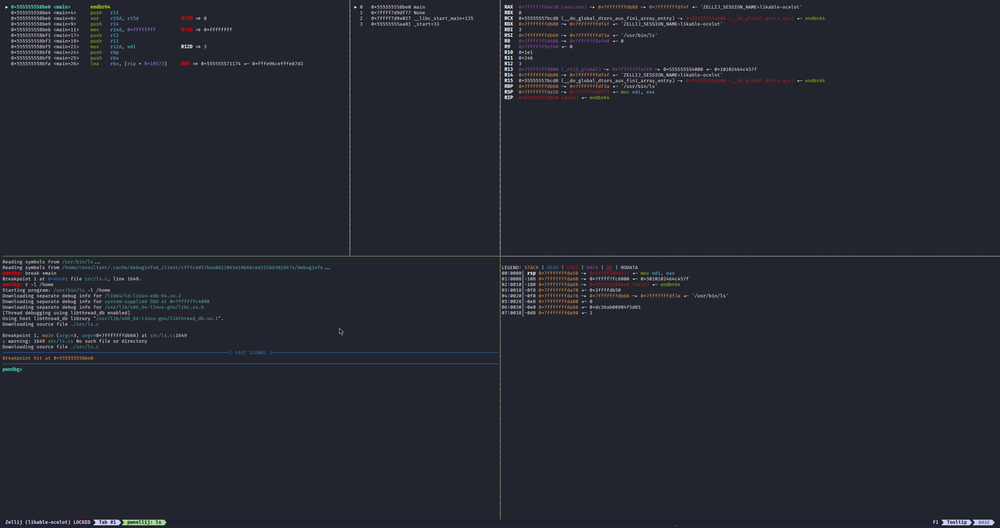

# pwnellij

[](https://github.com/sebpapararo/pwnellij/actions/workflows/ci.yml)
[](LICENSE)

pwndbg's context split across zellij or tmux panes, one section per pane.



Requires GDB with [pwndbg](https://github.com/pwndbg/pwndbg), plus [zellij](https://zellij.dev/) or tmux.

## Install

```shell
curl -sSfL https://raw.githubusercontent.com/sebpapararo/pwnellij/main/scripts/install.sh | sh
```

Clones pwnellij, puts the `pwnellij` launcher on your `PATH`, and writes a default
layout into a clearly-marked block in `~/.gdbinit`. Re-run it to update — the rest
of your `~/.gdbinit` is left alone. Prefix the command with
`PWNELLIJ_MULTIPLEXER=tmux` to get a tmux layout instead.

<details>
<summary>Installer options, and installing by hand</summary>

| Variable | Default | Purpose |
| --- | --- | --- |
| `PWNELLIJ_DIR` | `${XDG_DATA_HOME:-~/.local/share}/pwnellij` | Where the checkout lives |
| `PWNELLIJ_BIN_DIR` | `~/.local/bin` | Where the launcher is symlinked |
| `PWNELLIJ_MULTIPLEXER` | `zellij` | `zellij` or `tmux` — which layout to write |
| `PWNELLIJ_NO_GDBINIT` | _(unset)_ | Install only, leaving `~/.gdbinit` untouched |
| `PWNELLIJ_NO_PWNTOOLS` | _(unset)_ | Skip the pwntools integration below |

By hand: clone the repo, `echo "source $PWD/pwnellij/gdbinit.py" >> ~/.gdbinit`, add
a layout as below, and run the launcher as `/path/to/pwnellij/bin/pwnellij`.
</details>

## Use

```shell
pwnellij ./your-binary
pwnellij --pid 1234            # also -p 1234, --pid=1234, --pid "$(pgrep -f foo)"
```

Opens gdb+pwndbg in a new zellij tab (or tmux window) named after what you are
debugging, then splits pwndbg's context into panes on the first `run`/`start` — or
the moment the process stops, when attaching. Everything except `-h`/`--help` is
passed straight through to gdb; `pwnellij --help` describes the rest.

> Attaching fails with `Operation not permitted` while the process is clearly
> there? Your kernel restricts ptrace. `1` in `/proc/sys/kernel/yama/ptrace_scope`
> allows attaching only to descendants — run with `sudo -E`, or
> `sudo sysctl -w kernel.yama.ptrace_scope=0`.

### With pwntools

`gdb.debug()` and `gdb.attach()` need no changes on your side, but pwntools
chooses the terminal gdb opens in and does not know about zellij — that support
exists on its dev branch, unreleased as of 4.15.0. Left alone it opens gdb in a
*new window*, while pwnellij, which inherits `$ZELLIJ` from your exploit script
like any child process, splits its context panes into the session you came from:
the prompt ends up in one place and the context in another.

The installer's answer is `bin/pwntools-terminal`, which pwntools picks up from
your `PATH` ahead of its own detection and which opens gdb in a tab of the
session you are already in. It also points pwntools at a standalone pwndbg when
it finds one, since `gdb.debug()` otherwise launches the system gdb, which
cannot `import pwndbg`:

```ini
# ~/.pwn.conf, written only when the gdb on your PATH lacks pwndbg
[context]
gdb_binary='/usr/local/bin/pwndbg'
```

Install with `PWNELLIJ_NO_PWNTOOLS=1` to skip both; delete
`~/.local/bin/pwntools-terminal` later to hand the choice of terminal back to
pwntools.

## Configure

The layout is a fluent chain in `~/.gdbinit`. Each directional call splits a new
pane off the last one created, and `display=` binds a pwndbg section to it:

```python
python
import pwnellij
(pwnellij.Layout()
  .above(display="disasm", size="75%")
  .left(display="regs", size="35%")
  .show("stack")
).build()
end
```

| Method | What it does |
| --- | --- |
| `.left/.right/.above/.below(display=, of=, **kw)` | Split a new pane in that direction. `of=` targets a different split (object or display name) instead of the last one. |
| `.show(display, on=)` | Bind another pwndbg section to an existing pane. |
| `.select(display)` | Change what the next split hangs off. `None` means the main pane. |
| `.tell_multiplexer(**kw)` | Backend-specific settings: `set_title="…"` (both backends), `show_titles=True\|"bottom"\|False` (tmux only — zellij always shows a pane's name once set). |
| `.build(**kw)` | Finalise the layout. `nobanner=True` drops pwndbg's per-section banners. |

Splits also accept:

| Kwarg | Effect |
| --- | --- |
| `size="35%"` | Pane size, in lines/columns or percent. Exact on tmux, best-effort on zellij. |
| `cmd="…"` | Run this in the pane instead of the default `cat`. |
| `use_stdin=True` | Pipe the pane's stdin into `cmd`, e.g. `cmd="grep foo"`. |
| `inferior=True` | Give the debugged program its own pane for stdin/stdout, via gdb's `inferior-tty`. Defaults `cmd` to an idle `tail -f /dev/null` so it cannot steal the program's input, and `clearing=False` so its output survives. |

### tmux instead of zellij

```python
(pwnellij.Layout(multiplexer=pwnellij.Tmux())
  .right(display="regs")
  .below(display="stack")
).build()
```

The launcher picks its multiplexer by looking for a `Tmux(` call in `~/.gdbinit`
(or `./.gdbinit`), defaulting to zellij; `PWNELLIJ_MULTIPLEXER` overrides that.
Tmux mouse mode is enabled by default so the wheel scrolls each pane's history,
and restored on exit — pass `Tmux(mouse=False)` to leave your setting alone.

Two zellij caveats: its CLI only splits right and down, so `left`/`above` are
emulated by splitting then swapping panes, and it resizes in coarse increments, so
`size=` gets as close as zellij allows rather than exact.

## Development

```shell
pipx install ruff pytest shellcheck-py     # once

ruff check . && ruff format .              # lint + format
pytest                                     # full suite
shellcheck -s sh bin/pwnellij bin/pwntools-terminal scripts/install.sh
```

All three should pass before a pull request, and user-facing changes get a line
under **Unreleased** in [CHANGELOG.md](CHANGELOG.md). Both shell scripts are POSIX
`sh`, not bash — that is what `-s sh` checks — so keep new shell code free of
`[[ ]]`, arrays, `+=`, `<<<`, `${v//x/y}` and `printf %q`.

## Credits

Originally a fork of [splitmind](https://github.com/jerdna-regeiz/splitmind) by
jerdna-regeiz.

AI tooling is used to aid the development of this project. Changes are reviewed
before landing, and CI runs the test suite on every push and pull request.
